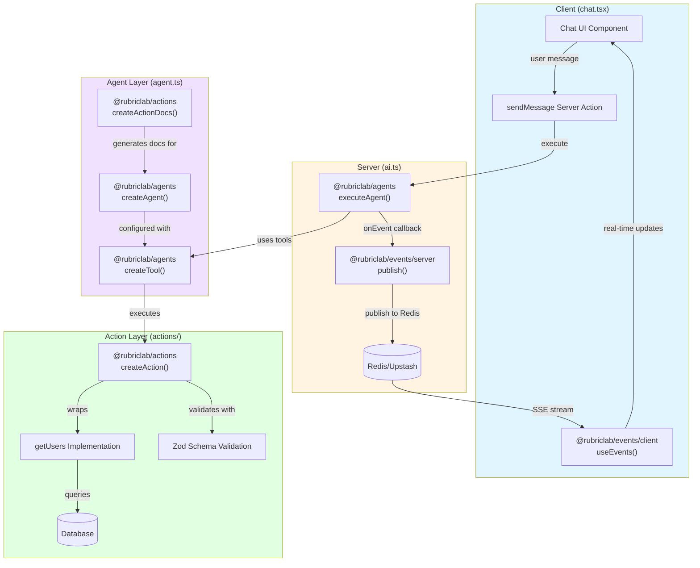

| Agent (demo)                                                    | Description                                            | Source code                                                                                | Packages used                                                                      |
| --------------------------------------------------------------- | ------------------------------------------------------ | ------------------------------------------------------------------------------------------ | ---------------------------------------------------------------------------------- |
| **[Addition Agent](https://chat.rubric.sh/addition-agent)**     | Simple tool-using agent demo                           | [GitHub](https://github.com/rubriclab/chat/tree/main/src/app/%28app%29/addition-agent)   | `@rubriclab/agents`                                                                |
| **[Weather Agent](https://chat.rubric.sh/weather-agent)**       | Agent with progress tracking via event stream          | [GitHub](https://github.com/rubriclab/chat/tree/main/src/app/%28app%29/weather-agent)    | `@rubriclab/agents`, `@rubriclab/events`                                           |
| **[Research Agent](https://chat.rubric.sh/research-agent)**     | Agent with tools and custom response format            | [GitHub](https://github.com/rubriclab/chat/tree/main/src/app/%28app%29/research-agent)   | `@rubriclab/agents`, `@rubriclab/events`                                           |
| **[DB Agent](https://chat.rubric.sh/db-agent)**                 | Database-interaction agent                             | [GitHub](https://github.com/rubriclab/chat/tree/main/src/app/%28app%29/db-agent)         | `@rubriclab/agents`, `@rubriclab/actions`, `@rubriclab/events`                     |
| **[Calculator Agent](https://chat.rubric.sh/calculator-agent)** | Calculator agent using recursive I/O chains            | [GitHub](https://github.com/rubriclab/chat/tree/main/src/app/%28app%29/calculator-agent) | `@rubriclab/agents`, `@rubriclab/chains`, `@rubriclab/events`                      |
| **[Website Agent](https://chat.rubric.sh/website-agent)**       | Static-site builder powered by blocks & chains         | [GitHub](https://github.com/rubriclab/chat/tree/main/src/app/%28app%29/website-agent)    | `@rubriclab/agents`, `@rubriclab/blocks`, `@rubriclab/chains`, `@rubriclab/events` |
| **[Form Agent (WIP)](https://chat.rubric.sh/form-agent)**       | Form builder with generic blocks and structured chains | [GitHub](https://github.com/rubriclab/chat/tree/main/src/app/%28app%29/form-agent)       | `@rubriclab/agents`, `@rubriclab/blocks`, `@rubriclab/chains`, `@rubriclab/events` |

## DB Agent Architecture

The DB Agent demonstrates how to build a database-interaction agent using three core Rubric packages:

### Data Flow

1. **User Input**: User sends a message through the chat UI
2. **Action Trigger**: Client calls `sendMessage()` server action
3. **Agent Execution**: Server executes the agent with `executeAgent()`
4. **Tool Usage**: Agent decides to use `getUsers` tool based on user query
5. **Action Execution**: Tool triggers the `@rubriclab/actions`-defined action
6. **Schema Validation**: Action validates input/output with Zod schemas
7. **Database Query**: Action executes database query
8. **Event Publishing**: Events are published to Redis via `@rubriclab/events`
9. **Real-time Updates**: Client receives events through SSE and updates UI

### Package Responsibilities

- **`@rubriclab/agents`**: Agent orchestration, tool calling, LLM interaction
- **`@rubriclab/actions`**: Type-safe action definitions with schema validation
- **`@rubriclab/events`**: Real-time bidirectional communication via Redis/SSE
